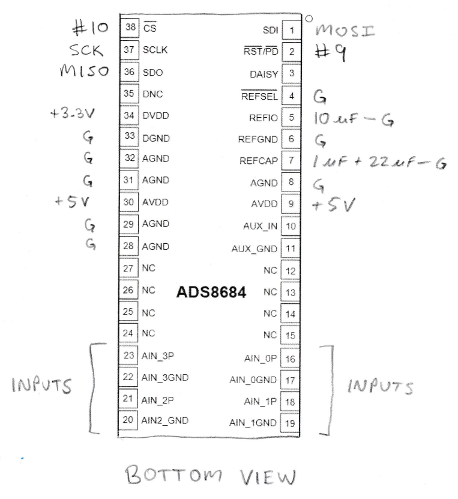
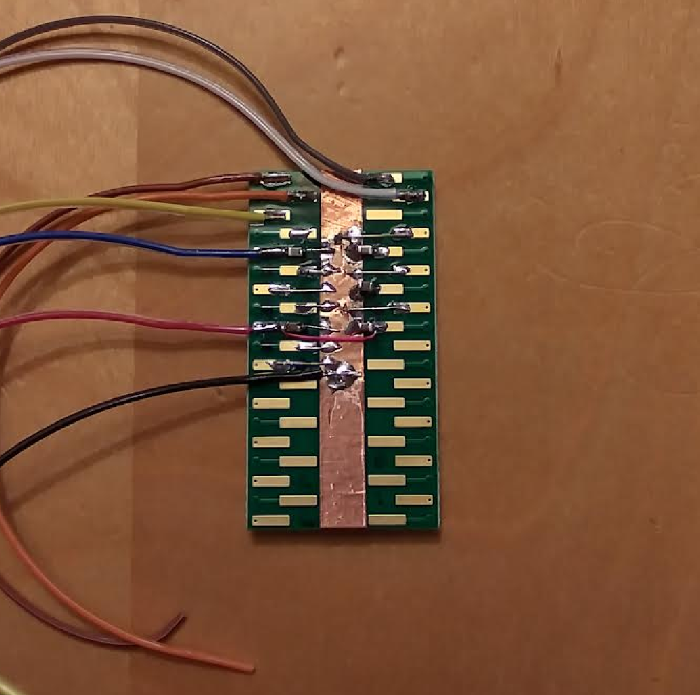

# ADS8684: A fast precision ADC for the Teensy 4 microcontroller board

Francis Deck

Here's a circuit, firmware, and Python library, for operating an ADS8684 16-bit ADC chip at a 500 kHz sampling rate, on a Teensy 4.0 board. The circuit is easy to build by hand on a breakout board, yet meets the datasheet specs for the ADC chip.

I'm going to use this circuit to build a "scope" capable of analyzing audio circuits, for fun. So I want it to at least exceed the Nyquist frequency for audio, which is about 40 kHz, with all channels running. 

Please note the *Available!* feature of the two main components. I started this project in the midst of the chip shortage, so my choices were partially guided by what I could actually find in stock from my favored suppliers.

## About the ADS8684 ADC chip

* 4 channels, 16 bits, 500 kHz
* Can be hand soldered
* Built-in buffered inputs eliminated a bunch of analog signal conditioning
* Available!

## About the Teensy 4.0 microcontroller board

* Can be programmed in the Arduino development environment
* Screaming fast: 600 MHz, dual core, built-in floating point
* Available!

# Circuit construction

I haven't designed a printed circuit board for the project yet.

Meanwhile it seems pretty attractive to leave it on the breakout board. The only challenge was soldering the TSSOP chip package, and a custom board won't make that any easier. The amount of hand wiring was minimal, and took just a few minutes of effort. And... in the spirit of the times, it makes little sense to spin up for production when the chip might suddenly become unavailable. This is going to be a "life is short" project.

I also have a "let's get coding" attitude. Building the circuit by hand was the quickest route to writing and testing firmware and software. Getting my test suite working will let me find out if my circuit theory is credible before starting the board design.

## Schematic diagram

The circuit is so simple that it doesn't need much of a schematic, especially when accompanied by the picture. I've shown a bottom view because my wiring is on the bottom of the breakout board. All of the digital signals are wired to pins on the Teensy 4 board. Both +3.3 V and +5 V power supplies are taken from the Teensy as well. We really shouldn't trust USB for clean analog power, but we'll see how well it actually performs.

## The first prototype

Here's the wiring job. It's that simple. I stuck a piece of copper foil tape to the bottom of the breakout board, though you could also use bare wire. The colored wires are from a piece of rainbow ribbon cable, my favorite source of hookup wire. All of them connect to Teensy pins.

## Software development

Turns out there's already a library!

	https://github.com/siteswapjuggler/ADS8688a
	
It doesn't handle high speed continuous data collection, but contains everything needed to set up the chip. So I use the ADS8688 library to configure all of the operating parameters of the chip at low speed, then I transfer control of the chip to an interrupt service routine that interacts directly with the Teensy 4.0 SPI hardware registers. The result is that my code is actually quite small.

You can use the example programs in the ADS8688a library to test your circuit before trying my firmware.

TODO: Remove the reset wiring if it's not necessary. One less wire.

## Thinking about fast data collection

Here's the math: The ADS8688 has a maximum SPI clock speed of 17 MHz, and a maximum sampling rate of 500 kHz. The entire SPI transaction is 32 bits long, which takes 1882 ns, but the entire time available to read the ADC at a sampling rate of 500 kHz is 2000 ns. This leaves precious little time, about 120 ns, for anything to happen in between samples.

The transaction is performed inside an interrupt service routine (ISR), triggered by an interval timer. The standard SPI transaction is "blocking," meaning that your program waits for the transaction to finish before proceeding. Thus 1882 out of 2000 ns is spent waiting. That's 94% of processing time, violating a rule that interrupts should consume minimal time.

Instead, I've broken up the transaction into separate parts for writing and reading data. This allows me to perform a "read then write" operation, with no waiting. My program can do other things while the SPI hardware performs the transaction.

There are still some minor issues. The 17 MHz clock frequency in the SPI settings is not quite enough to finish each transaction before the next interrupt starts, wreaking havoc. (This is noticeable because a grounded input produces seemingly random garbage). My scope isn't quite good enough to tell if it's exactly 17 MHz, but it seems a bit higher, so I raised the frequency in my program to 18 MHz and everything worked fine. In any event, the clock speed is approximate because it's based on a small integer divisor.

## Building a simple API

We need a command "language" for interacting with the board. My preferences are: Human readable, and easily translated by a language like Python. Typing commands into the terminal is useful for debugging, but ultimately, anything elaborate will benefit from scripting. 

My preference *du jour* is JSON format. There are lovely libraries for JSON for Arduino, as well as for most languages on the PC side. It's not as "tight" as you could imagine, but the Teensy is so fast that it's OK to waste a few bytes. Thanks to libraries on both ends of the USB cable, I don't have to write any low level parsing code. And it's really easy to add stuff to the API.

Everything in JSON is a key and a value, such as 

	{"npts": 4096}
	
You can have multiple key-value pairs in one string, such as 

	{"npts": 4096, "fsamp": 200000, "read": 1, "dump": 1}
	
Every key needs a value, so keys that represent commands are given a value that's ignored.

## API command list

	{"fsamp": f} sets the sampling frequency in Hz
	
	{"npts": n} sets the number of data points in the array
	
	{"status": 1} prints all of the current settings, and then some
	
	{"read": 1} reads a block of data into a memory buffered
	
	{"print": 1} prints the data in text format, useful for debugging
	
	{"dump": 1} prints a text header, followed by the contents of the array in binary format
	
	{"chans": list} sets the list of input channels that are turned on, such as [0, 1].
	
	{"ranges": list} sets the input ranges for the turned-on channels, such as [0, 2].
	
		0: +/- 10.24V (default on power-up)
		1: +/-  5.12V
		2: +/-  2.56V
		3: +/-  1.28V
		4: +/-  0.64V
		5: 0 to 10.24V
		6: 0 to 5.12V
		7: 0 to 2.56V
		8: 0 to 1.28V
	
A typical application would start with a hardware setup, connecting your signals to the ADS8684 inputs, and deciding what input range you want for each signal. Next, a command like this sets up the chip to match your hardware setup:

	{"chans": [0, 1], "ranges": [0, 0]}
	
That command chose the first two input channels, and gave each one a range of +/- 10.24 V. Readings are done with a command like this:

	{"read": 1, "dump": 1}
	
You can see how this is programmed, in the Python code.

## The Python side of things

The **python** folder contains a Python package for talking to the board, and some test code. By the time I started writing the Python code, I had already done some testing by entering JSON strings into a terminal. But by the time I've got the Python running, I rarely return to the terminal, and I test updates to the firmware with Python programs or a Jupyter notebook.